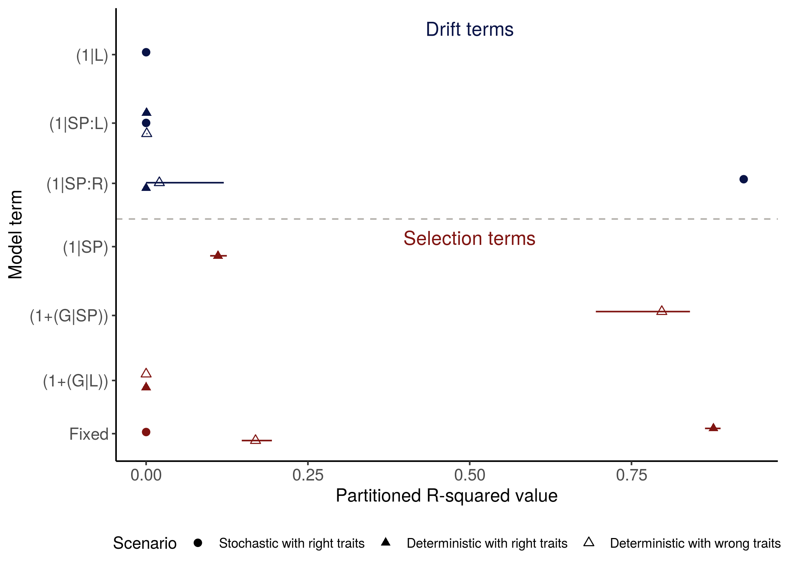

```{r setup, include=FALSE}
knitr::opts_chunk$set(echo = FALSE, message = FALSE, warning = FALSE)

# Libraries
library(kableExtra)

# Reading output from simulations
## Listing files
prop_df <- read.csv("results/supplementary_01.csv")
colnames(prop_df) <- c("Scenario", "Trait-mediated Selection & Drift", "Selection & Drift", "Trait-mediated Selection", "Selection", "Drift", "Idyosyncratic")
```

In order to show how we implemented our framework and how model
components are translated into niche and neutral dynamics we performed
simulations as described below. Our goal is to
address main criticisms of our framework being: (1) Are fixed and random
effects actually capturing niche and neutral dynamics? (2) Are random
effects only capturing neutral dynamics or uninformed species traits
are inflating random effects?

## Material and Methods 

We use simulated communities based on niche and neutral dynamics in order to
show how fixed and random effects capture different ecological
processes. Also, we use traits with strong and weak correlations to
species abundance in order to show how fixed and random effects
capture neutral dynamics when traits are uninformative. Therefore, we
simulate stochastic and deterministic meta-communities and use strong
or weak traits in model selection.

We simulate meta-communities with the same data structure as our
abundance data of ferns in three mountain chains in southern
Brazil. Then, we make Poisson of communities and use samples from the
meta-communities in our model selection framework.

We analyze into three scenarios:

* Deterministic community with traits strongly correlated with species
  abundance from Poisson sample
* Deterministic community with traits poorly correlated with species
  abundance from Poisson sample
* Stochastic community with traits strongly correlated with species
  abundance from Poisson sample

### Building simulated communities

We used the R [package MCSIm](http://rstudio-pubs-static.s3.amazonaws.com/159425_80725873417e42fdb13821c10a198281.html) from Eric Sokol to create simulations of metacommunities to test assumptions about their underlying processes underlying (Sokol et al. 2015). To replicate a data set analogous to our data all metacommunities were composed by 30 sites in three regions with 153 species. We fixed the total number of individuals in the metacommunity as 1000000 and migration parameter 0.5. Deterministic communities were modelled based on an environmental gradient that weights the selection of species from the species pool based on their traits. In addition, deterministic communities exhibit a flat dispersal kernel. For deterministic communities with strong traits, traits are highly correlated with the environmental gradient. In, stochastic communities species are also selected based on the environmental gradient, however the standard deviation from the mean response to the gradient is incredible high. Also, stochastic communities exihibit a dispersal kernel of 200. For each scenario we generated 100 communities that were then sampled with sampling effort of 20000 individuals. Our objective here is to generate
a scenario in which data is sampled from a Poisson distribution,
representing the structure of species abundance data

### Fitting models to simulated data 

We used our framework to fit models for each community in the three scenarios. We then calculated the proportion of the models with $\Delta{AIC} < 2$ belonging to each of our hypotheses and the adjusted $R^{2}$. We depicted all best models in terms of their adjusted
$R^{2}$. Adjusted $R^{2}$, as they measure the relative importance of
fixed and random effects in the model, are used here a proxy of
correspondence of community processes to terms in the
model. We adapted scripts from Johnson (2014) to calculate marginal and
conditional $R^{2}$ of each models, and also the enhanced agreement
repeatibility (Stofel et al 2107), or the ratio of the intra-class
variance for a given random factor and the total variance estimated by
the models, including fixed-effect variances. These functions are
available in the script 'functions.R' but applies only to models within our framework. For generic functions please see packages (rptR and MuMIn).


```{r table-prop}
tab1 <- "Proportion of models with Delta AIC <  2 at each scenario."
kable(prop_df, digits = rep(2, ncol(prop_df), colnames = names(prop_df)), 
      caption = tab1) %>% kable_styling()
```




